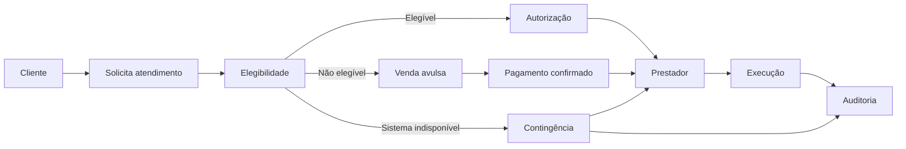

# Especificação Funcional — Protótipo

## Jornada central

## Módulos
1. Cliente.
2. Contratos.
3. Planos.
4. Atendimento.
5. Autorização.
6. Prestadores.
7. Cobrança.
8. Financeiro.
9. Centro de resultados.
10. Contingência.
11. Auditoria.
