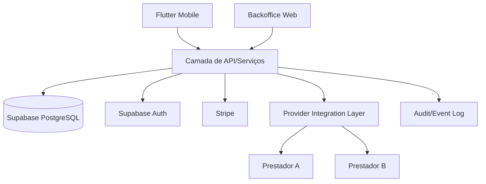

# Visão de Arquitetura

## Decisão principal
A CuraNexo é o núcleo de domínio. Stripe, Supabase e prestadores são infraestrutura/integrações.

O ERP citado no material consultivo não faz parte da arquitetura-alvo desta solução.
