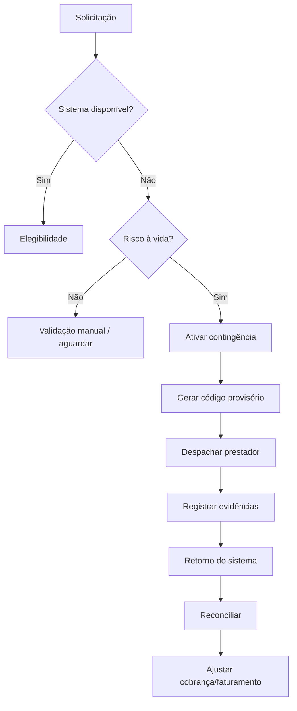

# Estratégia de Contingência

## Níveis

### Nível 0 — Normal
Sistemas disponíveis. Elegibilidade sistêmica obrigatória e autorização única.

### Nível 1 — Degradação
Integrações indisponíveis, mas operação central disponível. Permitir procedimentos manuais controlados.

### Nível 2 — Contingência
Sistema central indisponível. Avaliar risco à vida.

### Nível 3 — Emergência
Risco à vida + indisponibilidade sistêmica. Ativar atendimento presumido conforme protocolo.

## Fluxo

## Regras
- Código de contingência deve ser único.
- Toda ação deve possuir operador/responsável e horário.
- Dados coletados durante contingência devem ser mínimos.
- Ao retornar, reconciliar contra contrato e regras vigentes.
- Divergências devem gerar pendência de auditoria.
