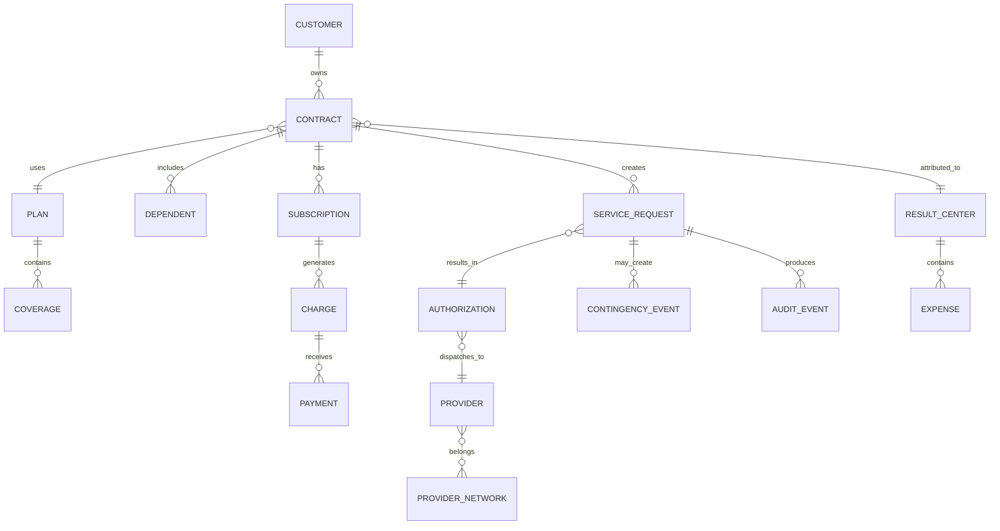

# ERD Conceitual

```mermaid
erDiagram
CUSTOMER ||--o{ CONTRACT : owns
CONTRACT }o--|| PLAN : uses
PLAN ||--o{ COVERAGE : contains
CONTRACT ||--o{ DEPENDENT : includes
CONTRACT ||--o{ SUBSCRIPTION : has
SUBSCRIPTION ||--o{ CHARGE : generates
CHARGE ||--o{ PAYMENT : receives
CONTRACT ||--o{ SERVICE_REQUEST : creates
SERVICE_REQUEST }o--|| AUTHORIZATION : results_in
AUTHORIZATION }o--|| PROVIDER : dispatches_to
PROVIDER }o--o{ PROVIDER_NETWORK : belongs
SERVICE_REQUEST ||--o{ CONTINGENCY_EVENT : may_create
CONTRACT }o--|| RESULT_CENTER : attributed_to
RESULT_CENTER ||--o{ EXPENSE : contains
SERVICE_REQUEST ||--o{ AUDIT_EVENT : produces
```
